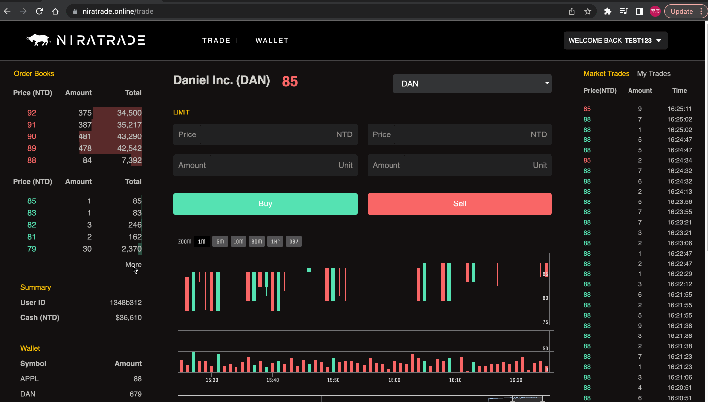
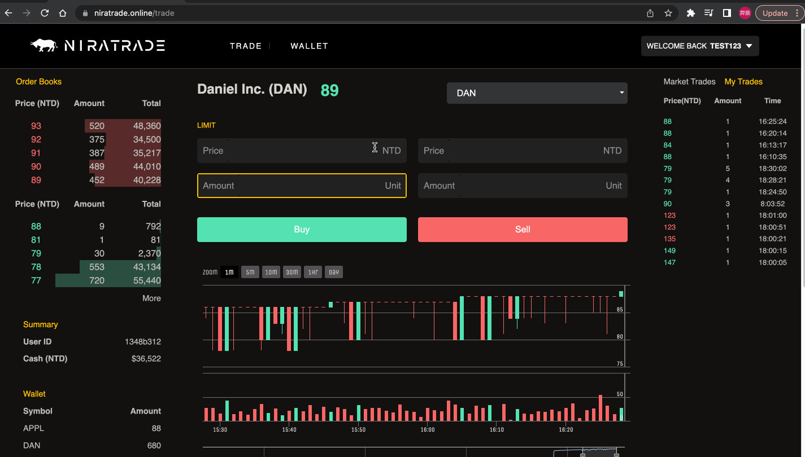
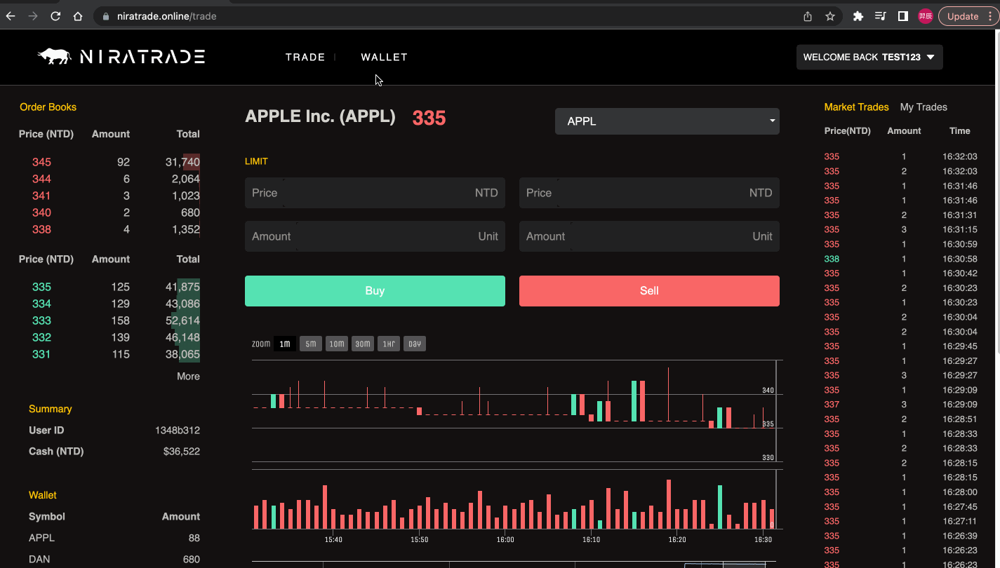
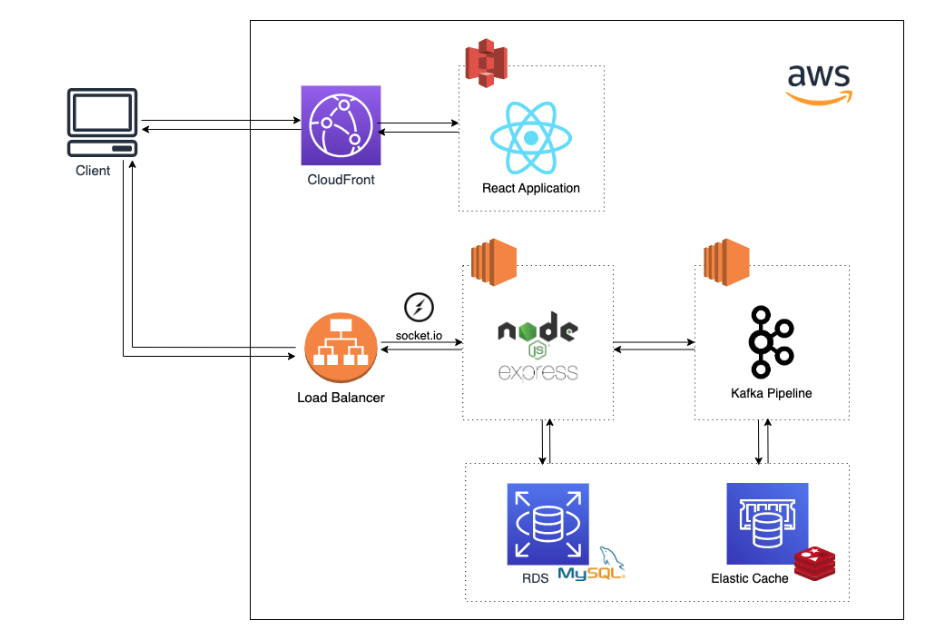
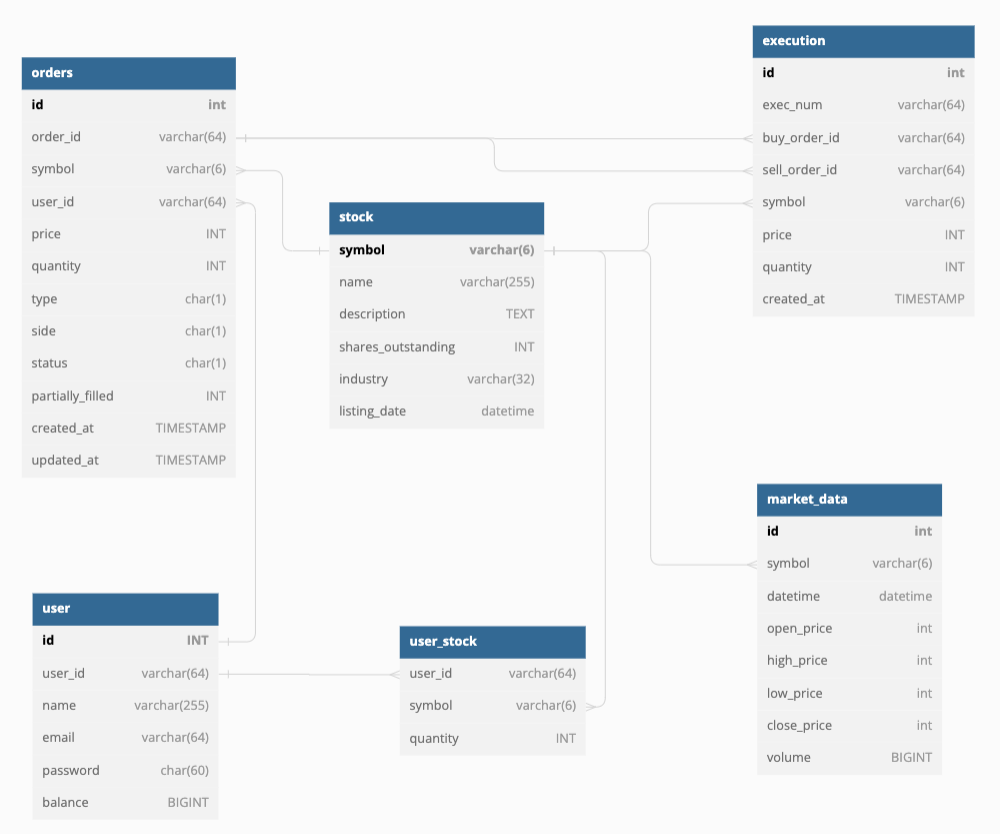

# NiraTrade

An interactive stock exchange platform empowers users to execute trades rapidly, monitor real-time market data, and review their portfolio holdings.

## Table of Contents

- [Demo Account](#Demo-Account)
- [Features](#Features)
- [Architecture](#Architecture)
- [Database Schema](#Database-Schema)
- [Technologies](#Technologies)
- [Contact](#Contact)

## Demo Account
Website URL: https://www.niratrade.online/

Demo Account
- Account: test123@gmail.com
- Password: 12345678

## 

## Features
- Realtime updates Order Books:
  - The initial order book displays a limited number of 5 orders.
  - After clicking "read more," the complete order book is displayed, showcasing the full list of available orders.
- Realtime updates Candlestick Chart:
  - Enable candlestick charts with multiple time ranges for comprehensive analysis.
  - Provide detailed information on the open, high, low, and close prices for each candlestick.
- Execution
  - By default, the initial execution displays all market-executed trades.
  - After clicking "My Trades," you can view your own executed trades. 
- Open Orders
  - At the bottom of the trade page, you can find detailed information about your open orders. 
  - You can cancel an open order by simply clicking on the garbage can icon associated with that specific order.
- Portforlio
  - You can access and view your portfolio by clicking on the "Wallet" page.
- History Orders
  - You can locate your history orders by selecting stocks, status, and side options at the bottom of the trade page.

### Order Books & Candlestick Chart & Execution 

### Open Orders

### Profolio & History Orders

## Architecture

## Database Schema

## Technologies

### Back-End

- Runtime: Node.js
- Framework: Express
- OS: Linux

### Front-End

- HTML
- CSS
- JavaScript
- React
- Styled Component
- Highcharts

### Database

- MySQL
- Redis

### Queue Service

- Kafka

### Cloud Service (AWS)

- Elastic Compute Cloud (EC2)
- Relational Database Service (RDS)
- ElastiCache for Redis
- Route 53

### Networking

- HTTPS
- SSL
- Domain Name System (DNS)

### Test

- Jest

### Others

- Socket.IO
- RESTful APIs
- Design Pattern: MVC
- Version Control: Git & GitHub
- Scrum: Trello
- Linter: Prettier & ESLint

## Contact

Daniel (Yi-chen) Chou @ danielchou777@gmail.com